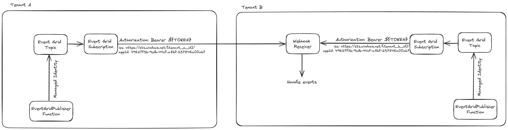

# Event Grid with Secure Webhooks

This is a proof of concept to test how an Event Grid Subscription can send webhooks to Azure Functions and authenticate / authorize them based on the Bearer token sent, and validate that the token is from a tenant in a list of allowed tenants and that the appId is from a list of allowed application ids.



## Setting up the environment

### Terraform

First, you need to be logged in with Azure CLI and be an Owner of the subscription this is going to be deployed. Make sure to remove the assignment for `sp-event-gird-webhook-poc` on the subscription and then remove it when the proof of concept is finished.

```shell
CURRENT_SUBSCRIPTION_ID=$(az account show --query id --output tsv)
mkdir -p .tmp/
az ad sp create-for-rbac --name sp-event-gird-webhook-poc --role Owner --scopes "/subscriptions/${CURRENT_SUBSCRIPTION_ID}" > .tmp/sp.json

TENANT_ID=$(cat .tmp/sp.json | jq -r ".tenant")
CLIENT_ID=$(cat .tmp/sp.json | jq -r ".appId")

cat <<EOT >> .tmp/poc.tfvars
common_name="sg"
environment="poc"
location="WestEurope"
location_short="we"
azure_client_id="${CLIENT_ID}"
azure_client_secret="$(cat .tmp/sp.json | jq -r ".password")"
azure_tenant_id="${TENANT_ID}"
azure_subscription_id="${CURRENT_SUBSCRIPTION_ID}"
webhook_receiver_allowed_tenant_ids=["${TENANT_ID}"]
EOT
```

## Deploying

### Step 1: Deploy terraform without event hub subscription

```shell
terraform -chdir=terraform/ init
terraform -chdir=terraform/ apply -auto-approve -var-file=../.tmp/poc.tfvars
```

### Step 2: Deploy the Webhook Receiver

```shell
WEBHOOK_RECEIVER_FUNCTION_NAME=$(terraform -chdir=terraform/ output -json | jq -r ".webhook_receiver_name.value")
env --chdir=webhook-receiver/ func azure functionapp publish ${WEBHOOK_RECEIVER_FUNCTION_NAME}
```

### Step 3: Deploy the EventGrid Publisher

```shell
EVENT_GRID_PUBLISHER_FUNCTION_NAME=$(terraform -chdir=terraform/ output -json | jq -r ".eventgrid_publisher_name.value")
env --chdir=event-grid-publisher/ func azure functionapp publish ${EVENT_GRID_PUBLISHER_FUNCTION_NAME}
```

### Step 4: Deploy terraform with event hub subscription

```shell
terraform -chdir=terraform/ apply -auto-approve -var-file=../.tmp/poc.tfvars -var="enable_event_grid_webhook_subscription=true"
```

### Step 5: Validate

In the Azure Portal, go to the Webhook Receiver function app and look at the logs.

When the logs are streaming, curl the publish endpoint like this: `curl -v https://[name].azurewebsites.net/api/publish`

If everything is working, you should get a `200 OK` from the curl and see the body of the request in the log stream.

## Running locally

### Webhook Receiver

```shell
ALLOWED_TENANT_IDS=$(terraform -chdir=terraform/ output -json | jq -r ".allowed_tenant_ids.value")
ALLOWED_APPLICATION_IDS=$(terraform -chdir=terraform/ output -json | jq -r ".allowed_application_ids.value")

cat <<EOT >> webhook-receiver/local.settings.json
{
  "IsEncrypted": false,
  "Values": {
    "AzureWebJobsStorage": "UseDevelopmentStorage=true",
    "FUNCTIONS_WORKER_RUNTIME": "dotnet-isolated",
    "ALLOWED_TENANT_IDS": "${ALLOWED_TENANT_IDS}",
    "ALLOWED_APPLICATION_IDS": "${ALLOWED_APPLICATION_IDS}"
  }
}
EOT
```

Start `Azurite` in a separate shell: `azurite --silent --location /tmp/azurite --debug /tmp/azurite/debug.log`

Run the function locally: `env --chdir=webhook-receiver/ func start`

### EventGrid Publisher

```shell
EVENT_GRID_TOPIC_ENDPOINT_URI=$(terraform -chdir=terraform/ output -json | jq -r ".event_grid_topic_endpoint_uri.value")

cat <<EOT >> event-grid-publisher/local.settings.json
{
  "IsEncrypted": false,
  "Values": {
    "AzureWebJobsStorage": "UseDevelopmentStorage=true",
    "FUNCTIONS_WORKER_RUNTIME": "dotnet-isolated",
    "EVENT_GRID_TOPIC__topicEndpointUri": "${EVENT_GRID_TOPIC_ENDPOINT_URI}"
  }
}
EOT
```

Login with Azure CLI and ensure that the current user has the role `EventGrid Data Sender` on the Event Grid Topic.

Start `Azurite` in a separate shell: `azurite --silent --location /tmp/azurite --debug /tmp/azurite/debug.log`

Run the function locally: `env --chdir=event-grid-publisher/ func start`

## License

This project is licensed under the MIT License—see the [LICENSE](LICENSE) file for details.
